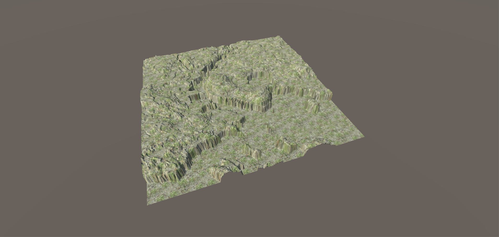

# CS4331002-VR-Project2

## Team Members
Jordan Coe - Camera controls, FPS controls, Scene changing scripts, partcle deletion scripts

Darien Sokolov - Fluvio particle scripts and implementation

Matthew Jordan - Terrain creation, scene set-up.

## Important Links
 <a href="https://youtu.be/VBiHO6CoQ8Q">Video Link</a>

<a href="https://assetstore.unity.com/packages/tools/particles-effects/fluvio-free-2888">Fluvio Assets Page</a>

<a href="https://unity3d.com/get-unity/download/archive">Unity Download 2017.1.3</a>

Download Link

### Instructions
Our project requires the downgrade to Unity 2017.1.3 to implement our Fluvio particle system. After having the correct version of Unity running and installing our project, you should be able to run our program. 

After hitting run a starting menu will appear which will give some instruction on some key commands and will allow the user to choose 1 of 3 terrains. After choosing a terrain a second menu will appear which will prompt the user to go to terrain. Once the user clicks go to terrain the scene will start with the user in first-person. The user will be able to view the simulated scene, by pushing "7" the user can enter third-person mode to obtain a better view of the scene. By pushing "5" the user can enter back into first-person mode. Once the user if finished viewing their particular scene, the user can push "9" to return to the starting menu so the user can choose another scene.

### Terrains
For our project, we choose 3 unique terrains for the user to choose from. 

#### Lubbock
Lubbock is a flat terrain with very little hills or terrain changes. This will help the user view a simulation on a flatter surface. 


#### Denver
The particular location that we chose near Denver is very mountainous. This will allow the user to see how water flows down mountainous terrain, similiar to a mudslide.


#### Ellsworth
Ellsworth, Maine, is a unique terrain which has valleys. This will show that water flows within the valleys and crevises before affecting the flatter terrain. 



### Camera Controls/UI
For the camera controls, we thought it would be beneficial if we have both a first-person and third-person view of our terrain. First-person view gives a realistic view of the scene, while a third-person view allows for an overall view of the scene. We downloaded predefined assets for the first-person and third-person controls. 

For the UI we created a Canvas with multiple buttons, which calls methods from a script on click. The code below shows a simple script to load other scenes. Setting up a button which runs the method SwitchSceneToDenver() will load the scene "DenverScene". This method is repeated for the various other scenes. 

```
public void SwitchSceneToDenver(){
		SceneManager.LoadScene("DenverScene", LoadSceneMode.Single);

	}
```
Another script we used was a script that switches from menu to the actual scene. The script below shows how you can turn off 1 camera and turn on another camera to switch views. If only 1 camera is on Unity will always display that particular camera. We use a similiar script to switch from first-person to third-person by turning off the first-person camera and turning on the third-person camera.

```
public void teleportDenver(){
		var startingcam = GameObject.Find ("StartingCam");
		startingcam.SetActive (false);

		objects [0].SetActive (true);
		objects[0].transform.position = new Vector3(51, 156, 53);
		Screen.lockCursor = true;

		var playerevent = GameObject.Find("TeleportPlayer");
		playerevent.SetActive (false);

		var canvas = GameObject.Find("Canvas");
		canvas.SetActive (false);

	}
  ```
  ### Partcle System
  For our particle system we decided to use Fluvio, which helps simulate water. This particular particle system has a 3000 particle   limit. Because of this we had to reduce the terrain down to a manageable size. Having an overwhelming amount of particles also reduces performance, so a smaller terrain also helps out performance. 
  
  <a href="https://assetstore.unity.com/packages/tools/particles-effects/fluvio-free-2888">Fluvio Assets Page</a>
  
  
  
  We ran into several problems using other particle systems. Some problems we ran into had to do with poor performing particle systems, particles that just bounced off of each other, and objects that bounced to much. We found that Fluvio has better performance, and the particles worked better when colliding with eachother.
  
  ### Conclusion
  Overall the project was a good intro into Unity. All though we did not finish everything that we wanted to accomplish, we believe that we did a good job for our first project. With more time and more learning, I believe that we could make a great simulation with good visuals and performance. 
  
  ### Assets
   <a href="https://assetstore.unity.com/packages/2d/textures-materials/floors/terrain-textures-snow-free-samples-54630">Snow</a>
   
   <a href="https://assetstore.unity.com/packages/2d/textures-materials/floors/grass-02-game-ready-29037">Grass</a>
    
   <a href="https://assetstore.unity.com/packages/3d/vegetation/trees/free-trees-103208">Tree 01</a>
   
   <a href="https://assetstore.unity.com/packages/3d/vegetation/trees/snowy-low-poly-trees-76796">Tree 02</a>
   
   <a href="https://assetstore.unity.com/packages/2d/textures-materials/sky/skybox-series-free-103633">Skybox</a>
   
   <a href="https://assetstore.unity.com/packages/vfx/shaders/fullscreen-camera-effects/rain-drop-effect-2-59986">Sound</a>
   
   <a href="https://assetstore.unity.com/packages/3d/environments/urban/lowpoly-modern-city-buildings-set-64427">Buildings</a>
   
   <a href="https://assetstore.unity.com/packages/3d/3le-low-poly-cloud-pack-65911">Clouds</a>

  
  
